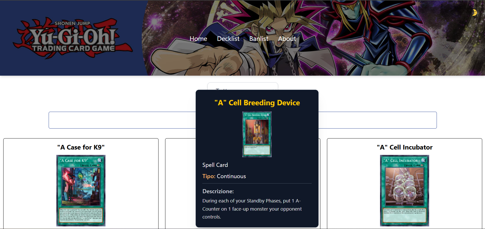

# 🃏 Yu-Gi-Oh! Database



Benvenuto nel **Yu-Gi-Oh! Database**, un’app creata con **Next.js** per tutti gli appassionati di Yu-Gi-Oh! 🎴

Questo progetto è nato come **elaborato finale** del percorso **Formatemp**, in collaborazione con l’azienda **Riverloop**, con l’obiettivo di mettere in pratica competenze moderne di sviluppo web e creare un’app divertente e utile.

---

## ✨ Funzionalità principali

- 🏠 **Home**: esplora i set e le carte più popolari
- 📋 **Decklist**: aggiungi le tue carte preferite al deck e salvale direttamente sul **local storage**
- 🔍 **Tooltip dettagliati**: ogni carta ha un tooltip con tutte le informazioni importanti
- 📜 **Banlist**: consulta le carte vietate o limitate del momento
- ℹ️ **About**: scopri chi ha creato l’app e il contesto del progetto

---

## 🛠️ Tecnologie utilizzate

- [Next.js](https://nextjs.org/) — Framework React per app moderne
- [React](https://react.dev/) — Libreria frontend
- [Tailwind CSS](https://tailwindcss.com/) — Styling semplice e veloce
- [Daisy UI](https://daisyui.com/) - Styling di alcuni componenti
- **Local Storage** — per salvare i deck degli utenti
- [API YGOProDeck](https://ygoprodeck.com/api-guide/) _(per i dati delle carte, se usata)_

---

## 🚀 Come provare l’app

Clona il repository:

```
git clone https://github.com/DavideSiracusano/yu-gi-oh-database.git
cd yu-gi-oh-database
```

Installa le dipendenze:

```
npm install
```

Avvia il server di sviluppo:

```
npm run dev
```

Apri il browser su 👉 http://localhost:3000
e inizia a esplorare!

📂 Struttura del progetto

```
yu-gi-oh-database/
├── src/ # componenti, pagine e logica dell’app
├── public/ # asset statici (icone, immagini)
├── package.json # dipendenze e script
├── next.config.mjs
└── README.md
```

👨‍💻 Autore

Davide Siracusano
📌 GitHub

⭐ Se ti piace questo progetto, lascia una star su GitHub!
Divertiti a creare il tuo deck e esplorare le carte di Yu-Gi-Oh! 🎴🔥
